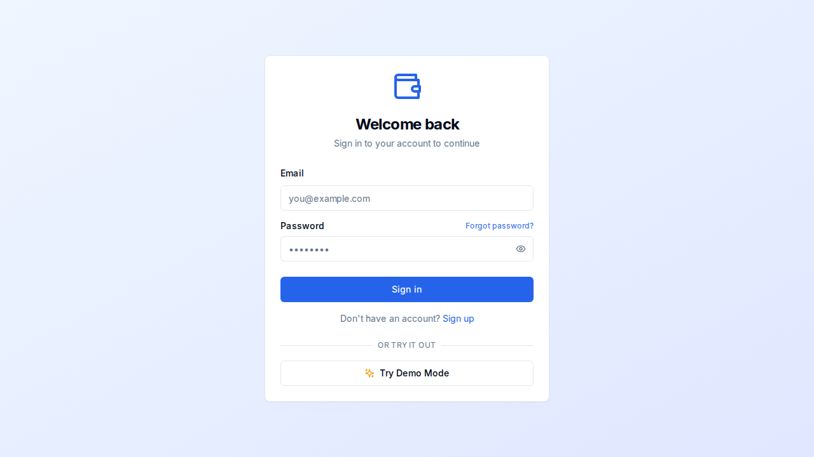
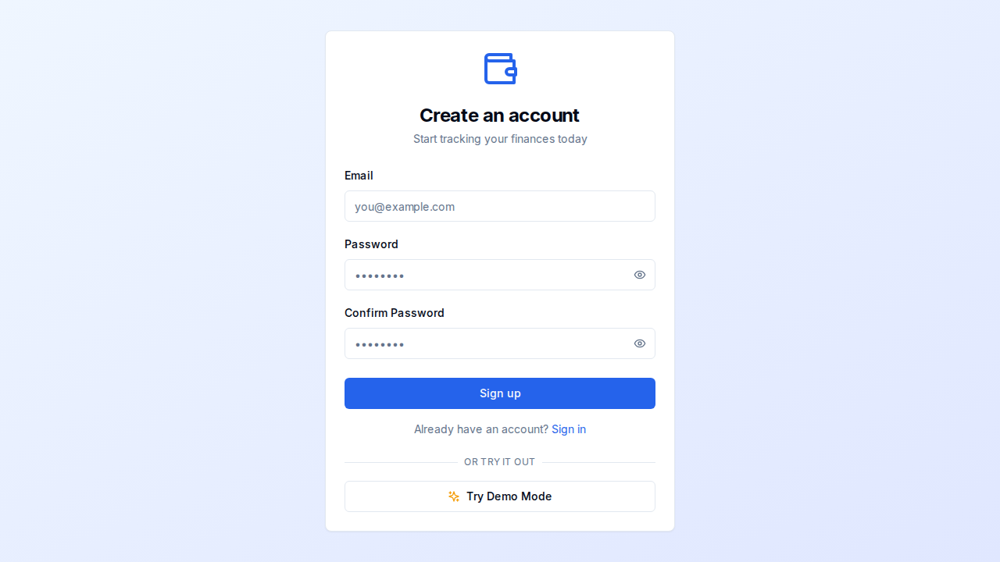

# Finance Tracker

Personal finance web app built with Next.js, TypeScript, Supabase, and Tailwind CSS. It covers day-to-day money tracking, account and category management, budgeting signals, spending insights, and portfolio monitoring in one dashboard-oriented product.

## Screenshots

### Login



### Signup



## What It Does

- Supabase email/password authentication with password reset flow.
- Dashboard overview with recent transactions and spending summaries.
- Transaction CRUD, filtering, and CSV import tools.
- Account management for different account types.
- Category management with editable defaults.
- Insights pages for category trends, monthly comparison, and spending analysis.
- Portfolio tracking with holdings, manual price updates, and overview metrics.
- User settings and rules-based finance configuration.
- Optional AI transaction categorization through the OpenAI API.

## Stack

- Next.js 14 App Router
- React 18
- TypeScript
- Tailwind CSS
- shadcn/ui and Radix UI
- Supabase
- OpenAI Node SDK
- Recharts
- OpenNext + Cloudflare deployment tooling

## Local Setup

### Prerequisites

- Node.js 18+
- npm
- Supabase project credentials
- Optional `OPENAI_API_KEY` for AI categorization

### Install

```bash
git clone git@github.com:HectorAlvarezPerez/finance-tracker.git
cd finance-tracker
npm install
```

### Environment

Create `.env.local`:

```env
NEXT_PUBLIC_SUPABASE_URL=https://your-project.supabase.co
NEXT_PUBLIC_SUPABASE_ANON_KEY=your-anon-key
SUPABASE_SERVICE_ROLE_KEY=your-service-role-key

OPENAI_API_KEY=sk-...

NEXT_PUBLIC_APP_URL=http://localhost:3000
CRON_SECRET=your-random-secret
NEXT_PUBLIC_ENABLE_REALTIME_PRICES=false
NEXT_PUBLIC_ENABLE_BANK_INTEGRATION=false
```

### Database

Apply the schema in `supabase/schema.sql`, then optionally seed defaults:

```bash
npx tsx scripts/seed.ts
```

### Run

```bash
npm run dev
```

Open `http://localhost:3000`.

## Deployment

This project is wired for OpenNext on Cloudflare rather than a plain Vercel deploy.

```bash
npm run cf:build
npm run deploy
```

`npm run deploy` runs the Cloudflare upload flow defined in `package.json` and `wrangler.toml`.
